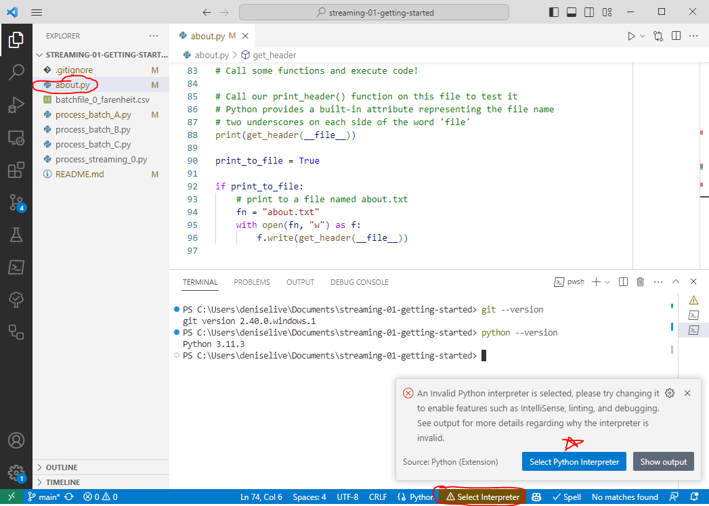
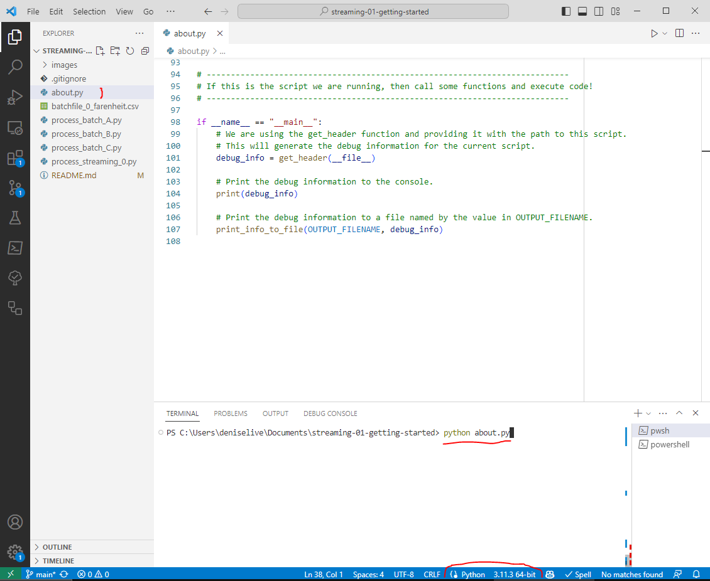

# streaming-01-getting-started

> Get started with Python for streaming analytics

Set yourself up for productivity and collaboration.
We assume no prior programming experience and that you want to 
get productive as quickly as possible.

## Prerequisites

1. Git
1. Python 3.7+ (3.11+ preferred)
1. VS Code Editor
1. VS Code Extension: Python (by Microsoft)

## Task 1. Fork

First, we'll copy this repository ("repo") into **your** GitHub account. 

1. Open your web browser (Chrome is recommended).
1. Log in to your free GitHub account.
1. Go to <https://github.com/denisecase/streaming-01-getting-started>.
1. Look at the URL (the web address). 
1. Note the account is denisecase.
1. Look at all the options available for a repo. 
1. Find and click the **Fork** button near the top.
1. Keep the defaults and click 'Create Fork'. 
1. When it finishes, look at the repo - note the account (it should be yours).

Forking is just a term for copying a repo from one account to another.

## Task 2. Clone

Next, clone **your** new GitHub repo down to the Documents folder on your local machine. 

1. Open VS Code. 
1. From the menu, select View / Command Palette.
1. Start typing Git: Clone and select it.
1. Provide the URL of **your** new GitHub repo.
1. When it asks where to put it, select your Documents folder.

The first time you do this, you'll be guided through a process to sign into GitHub from VS Code. 
You can read more about cloning - and clone your repo without VS Code by following the instructions [here](https://docs.github.com/en/repositories/creating-and-managing-repositories/cloning-a-repository).

When done, verify you have a new folder in your Documents directory:
`Documents/streaming-01-getting-started`

## Task 3. Explore

Explore your new project repo in VS Code on your local machine. 

If the project is not already open in VS Code, do this:

1. Open VS Code.
1. From the menu choose File / Open Folder / and select Documents/streaming-01-getting-started.
1. In the primary side bar, expand the repo folder so you can see the files. 

Once opened, explore - consider these questions:

1. Where is this README.md file? 
1. Can you see a .gitignore file? 
1. What do you think the .gitignore file does? (Hint: open it.)
1. Review the repo files and the organization.
1. Check the file extensions (e.g., .py) to see what types of files are included in this repo.

## Task 4. Execute About Script

Execute about.py to generate some useful information.

1. Click on the about.py file to open it for editing.
1. Right-click on about.py and select "Run Python File in Terminal".
1. If you get a prompt to install the Python extension, go ahead and install it.
1. If you get a prompt to select a Python interpreter, select the one you want to use. Your default Python interpreter should be fine.
1. Watch what happens in the integrated terminal window. 
1. If successful, you should get a new about.txt file.
1. Click on the new about.txt file to learn more about your Python environment. 

For more information about options for executing a Python program in VS Code, see [Run Hello World](https://code.visualstudio.com/docs/python/python-tutorial#_run-hello-world).





## Task 5. Execute the Remaining Scripts in Order

Open, read, and run each remaining Python script (each file will have a .py extension) in order.
You don't need to fully understand the code yet. 
Instead, try to figure out what each file is doing. 
Like learning any new language, reading is a bit easier than 
writing - we can learn much just by seeing it. 
By the end of the course, the code will make much more sense. 

When you finish, you'll have an idea of some things possible using just the Python standard library. 
You'll have generated several new data files.
The streaming process will run continuously for quite a while. 
Read the comments in the file to learn how to stop the process.

## Task 6. Edit the README.md File

Edit this file to keep just the commands and information you need for your machine.
Generally, keep the prerequisites and task headings, with the commands (or process) that worked on your machine.
Remove unnecessary instructions once mastered. 

## Task 7. Commit Changes and Push to GitHub

Now it's time to get the local work you did on your machine, 
back up to your cloud repo in GitHub.

With git, we first git add any new files, 
then git commit them to source control (with a message), 
then git push them up to GitHub. 

### Option 7A: Use VS Code (Easy!)

1. On the VS Code side panel, click the source control icon (look for a blue bubble with an number in it).
1. Important! Above the Commit button, it will say "Message". 
1. You must include a message. 
1. In that message input box, type "initial results".
1. Click the down arrow on the blue "Commit" button to "Commit and Push" or "Commit and Sync" it to your GitHub repo. 

Verify: Open a browser to your GitHub repo and see if the files have appeared. 
In addition to the original files, you should have one or more new files and an edited Markdown file. 
If not, return to VS Code and edit/execute files as needed.

Common Issue: If your computer hangs because you forgot the commit message, 
just enter your message in the top line of the file it shows in the editor.
Then click the checkmark in the upper right to close that file and save your commit message.
"Sync your changes" to push. 

### Option 7B: Use Git Bash or Terminal Commands (Easy as well):

Open a new Git Bash or Terminal window. Run the following commands one at a time.
They will first add all the files (add "dot"). 
Then they will commit the changes with a message. 
Finally, they will push the changes up to GitHub.

```
git add .
git commit -m "initial results"
git push origin main
```


-----

## General Recommendations and Troubleshooting

The following are general recommendations and troubleshooting tips.

### Issue: VS Code - No Source Control Icon

Suggestion: If you're in VS Code, and you don't see the Source Control icon with a blue bubble, right-click on the sidebar icons, and make sure "Source Control" is checked.  

### Issue: VS Code wants to install an extension

If VS Code suggests an extension, it's often good to go ahead and try it. 
Do a search on the extension to learn more. VS Code suggestions are usually helpful. 

## Additional Resources

1. For more information about Git in VS Code, see [Using Git source control in VS Code](https://code.visualstudio.com/docs/sourcecontrol/overview).
1. For more information about editing Markdown in VS Code, see [Markdown and Visual Studio Code](https://code.visualstudio.com/docs/languages/markdown).
